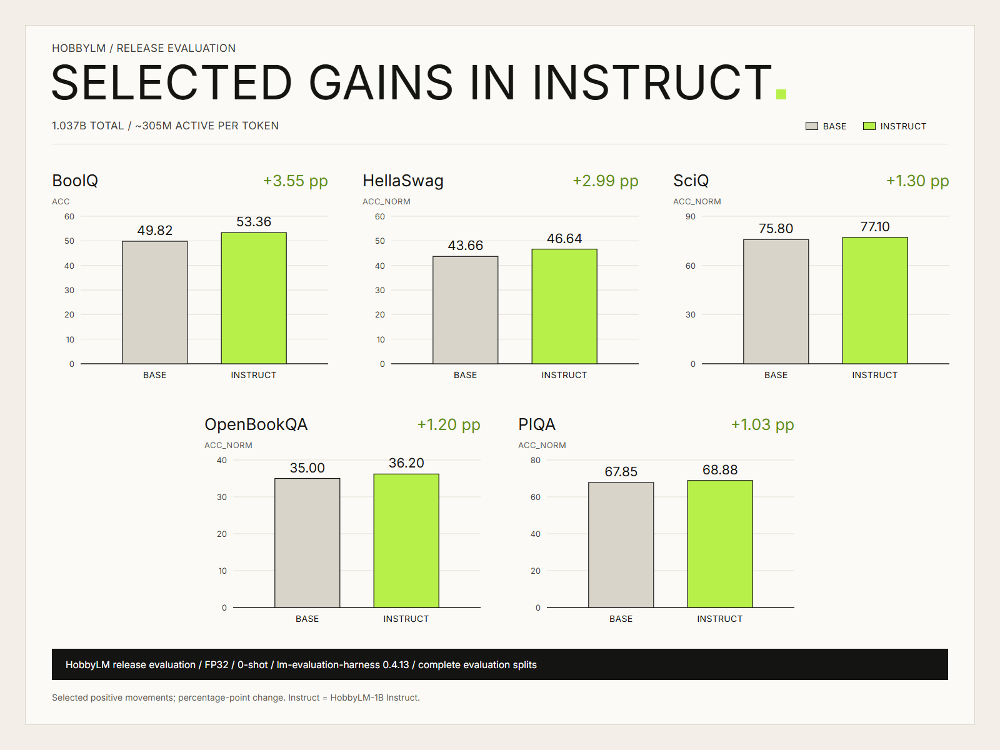
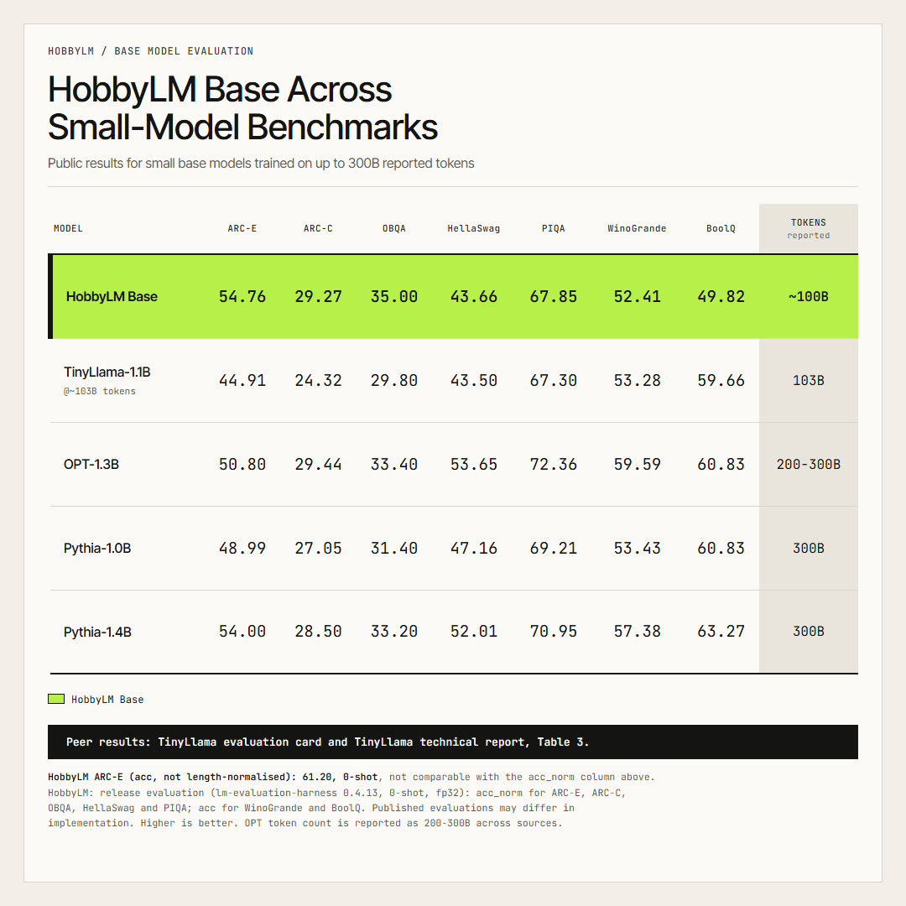
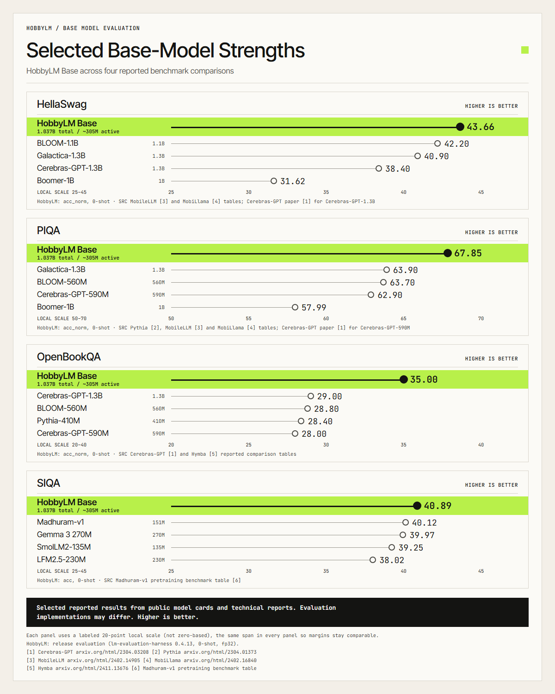
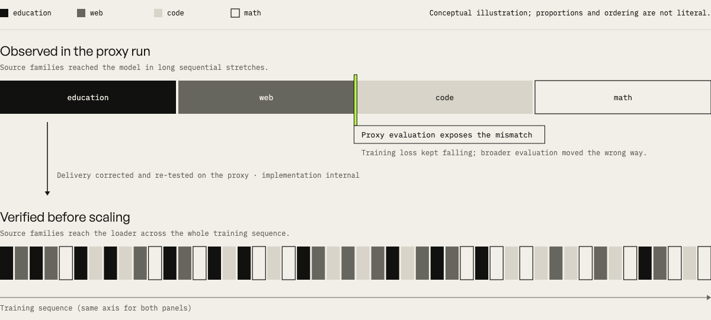
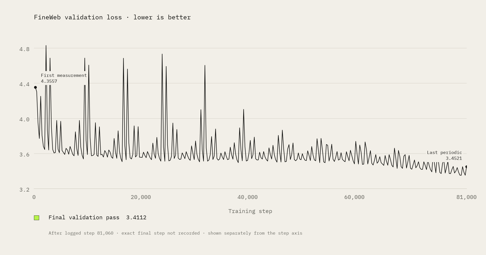

<p align="center"></p>

# HobbyLM-1B

A small **sparse mixture-of-experts** language model, trained from scratch on **100B tokens**: 1.04B total parameters, about 305M active per token.

Two models are released:
- the **base** model (text continuation);
- an **instruction-tuned** model, **HobbyLM-1B Instruct**, which follows simple instructions, rewrites and extracts text, and makes single function calls in a Python-list format.

| | |
|---|---|
| **Try it in the browser** | [HobbyLM-1B chat (Hugging Face Space)](https://huggingface.co/spaces/harims95/hobbylm-1b-chat) |
| **Run it on Windows, easiest** | [Double-click chat bundle](https://github.com/fuellabs-ai/hobbylm-1b/releases/tag/v1.0.0): download `HobbyLM-1B-Chat-Windows-x64-1.0.0.zip`, extract, double-click **`Start HobbyLM.bat`**. The chat opens in your browser and runs offline on your computer. |
| Base model (Transformers) | [harims95/hobbylm-1B](https://huggingface.co/harims95/hobbylm-1B): final annealed base, model card, release evaluation |
| Instruct model (Transformers) | [harims95/hobbylm-1B-instruct](https://huggingface.co/harims95/hobbylm-1B-instruct): HobbyLM-1B Instruct at the repository root |
| GGUF files | [harims95/hobbylm-1B-gguf](https://huggingface.co/harims95/hobbylm-1B-gguf): instruct Q4_K_M, Q8_0, F32; base F32. Converter: [`gguf/`](gguf/) (reproduces the published F32 file bit for bit) |
| Checkpoints (Transformers) | [harims95/hobbylm-1b-checkpoints](https://huggingface.co/harims95/hobbylm-1b-checkpoints): final annealed base, 4K context extension and instruct, one subfolder each |
| Patched runtimes (Windows, CPU) | [Release page](https://github.com/fuellabs-ai/hobbylm-1b/releases/tag/v1.0.0): patched llama.cpp, patched Ollama, and their source archive. Patches, launchers and build steps: [`runtimes/`](runtimes/) |
| Evaluation method and results | the **Evaluation Results** section of the [base model card](https://huggingface.co/harims95/hobbylm-1B) |

## Repository contents

| Path | What it is |
|---|---|
| [`hobbylm_hf/`](hobbylm_hf/) | Model architecture and configuration (`modeling_hobbylm.py`, `configuration_hobbylm.py`). Byte-identical to the files that `trust_remote_code=True` loads from the Hugging Face repositories. |
| [`examples/`](examples/) | Runnable inference examples: base-model completion, Instruct chat with the chat template, and a 4,096-token input with the Instruct model. |
| [`gguf/`](gguf/) | GGUF converter (reproduces the published F32 file bit for bit) and its instructions. |
| [`runtimes/`](runtimes/) | Patches, launchers and build instructions for the patched llama.cpp and Ollama runtimes in the release. |
| [`ARCHITECTURE.md`](ARCHITECTURE.md) | Architecture details read from the released configuration. |
| [`tests/`](tests/) | Offline checks that run without downloading the model. |

## Quickstart

Python 3.10 or later. The model must run in **float32**.

```bash
git clone https://github.com/fuellabs-ai/hobbylm-1b
cd hobbylm-1b
pip install -r requirements.txt
python examples/generate_base.py          # base model, text completion
python examples/chat_sft.py               # instruction-tuned model, chat template
python examples/long_input_4k.py          # Instruct model with a ~3,900-token input
```

The examples download the released weights from Hugging Face (about 4.2 GB per model) and pin exact revisions. They load the model code that ships with the weights; [`hobbylm_hf/`](hobbylm_hf/) holds the same code for reading and for offline use (`--local-code`).

## What it does

These are examples from the instruction-tuned model, generated greedily. They are recorded outputs, not cherry-picked averages; see the main model card for overall results.

```
User: Extract the name, department, and years of experience from this sentence as JSON:
      "Priya Nair, a senior engineer in the Infrastructure department, has 8 years of experience."
HobbyLM: {"name": "Priya Nair", "department": "Infrastructure", "years": 8}
```

```
User: Rewrite this sentence to remove the redundancy: "At this point in time, we are currently
      reviewing the proposal document that was submitted to us."
HobbyLM: We are currently reviewing the proposal document that was submitted to us.
```

## Measured results

The release evaluation covers 11 benchmarks, both models, all 0-shot: lm-evaluation-harness 0.4.13, fp32, all examples of each split.

| Benchmark | Metric | Base | Instruct |
|---|---|---:|---:|
| HellaSwag | acc_norm | 43.66 | 46.64 |
| ARC-Easy | acc_norm | 54.76 | 54.12 |
| ARC-Challenge | acc_norm | 29.27 | 28.41 |
| PIQA | acc_norm | 67.85 | 68.88 |
| WinoGrande | acc | 52.41 | 50.75 |
| OpenBookQA | acc_norm | 35.00 | 36.20 |
| BoolQ | acc | 49.82 | 53.36 |
| SIQA | acc | 40.89 | 40.33 |
| CommonsenseQA | acc | 19.98 | 18.18 |
| SciQ | acc / acc_norm | 82.90 / 75.80 | 82.70 / 77.10 |
| MMLU (**0-shot**) | acc | 25.31 | 24.78 |

- Scores are in percent. Standard errors, setup and disclosures are in the main model card; for example, one base BoolQ document was left-truncated.
- CommonsenseQA and MMLU are near their random-guess baselines (20% and 25%).
- No average is given, because the metrics differ.

The chart below is a selected view of positive movements from Base to Instruct, not a composite score or a claim that every benchmark improved; the full results, including regressions, are in the table above.



**IFEval (Instruct only; the base model was not evaluated on IFEval).** All 541 prompts; official lm-eval 0.4.13 scoring; the model's chat template; greedy; 2,048-token response budget.

| Prompt-level strict | Instruction-level strict | Prompt-level loose | Instruction-level loose |
|---:|---:|---:|---:|
| 22.92 | 37.77 | 24.95 | 40.53 |

- **Cap hits:** 135 of 541 responses (25.0%) reached the 2,048-token limit; most were flagged as repetitive by a simple heuristic.
- **Training overlap:** 2 prompts overlap the final instruction-tuning mix. The scores above include them.

### Published scores of similar small MoE base models (not a matched evaluation)

The numbers below come from each developer's own paper or card, under **their** setups (different precision, harness version and tokenizer). They were not run by us.

| Same-shot benchmark | HobbyLM base | MobileMoE-S-Base (Meta) | Granite-3.0-1B-A400M-Base (IBM) |
|---|---:|---:|---:|
| HellaSwag (0-shot) | 43.66 | 58.9 | — (10-shot) |
| PIQA (0-shot) | 67.85 | 75.4 | 75.35 |
| SIQA (0-shot) | **40.89** | 46.8 | 35.76 |
| WinoGrande (0-shot) | 52.41 | 58.6 | — (5-shot) |
| ARC-Easy (0-shot) | 54.76 | 73.9 | — |
| OpenBookQA (0-shot) | **35.00** | 34.6 | 39.00 |
| BoolQ (0-shot) | 49.82 | 60.2 | — (5-shot) |
| Training tokens | **100B** | about 6.5T | 10T |
| Total / active parameters | 1.04B / 305M | 1.3B / 272M | 1.3B / 400M |

- **Bold** marks the two HobbyLM scores above one listed model: SIQA (above Granite, +5.13 pp) and OpenBookQA (above MobileMoE-S-Base, +0.40 pp, within our ±2.14 standard error). On every other row with the same shot count, the listed models report higher scores.
- **The competitors were trained on 65–100× more tokens.** Granite's report does not state which metric (acc or acc_norm) it used.
- **Sources:** MobileMoE-S-Base: [arXiv:2605.27358](https://arxiv.org/abs/2605.27358), Table 2 (the `facebook/MobileMoE-S-Base` card shows the same values). Granite-3.0-1B-A400M-Base: [Granite 3.0 technical report](https://github.com/ibm-granite/granite-3.0-language-models/blob/main/paper.pdf), Table 9.

### Compact base models

These figures place selected HobbyLM Base results alongside public results reported for compact peer models. Scores are percentages and higher is better. Peer evaluations come from public model cards and technical reports; implementations may differ across sources. The source notes and scale treatment are included in each figure.





## Running it

| Route | Status |
|---|---|
| Transformers (Python) | `trust_remote_code=True`, **float32** (bf16/fp16 change which experts are chosen). Examples: [`examples/`](examples/) and the Quickstart below. |
| Windows double-click bundle | tested: extract → launch → browser chat → close → relaunch |
| Patched llama.cpp (Windows, CPU) | tested: chat server with browser page, and base-model completion |
| Patched Ollama 0.35.1 (Windows, CPU) | tested: model import and chat; runs separately from any installed Ollama (port 11435, own data folder) |
| **Stock Ollama v0.35.1** | **tested: does not load the model** (`attn_qkv.weight` shape error). Use the patched runtime. |
| Stock llama.cpp | not run; it expects the same tensor shape as Ollama and needs our one-line patch |

**Tested platform:** Windows 11 x86-64, CPU backend, **one machine**: AMD Ryzen 9 5900HX, AVX2 ("haswell") code path.
- **Measured on that machine** (Q4_K_M): about 14 tokens/s generation, about 1.3 GB peak memory.
- **Not tested:** other x86-64 CPUs (the runtimes include variants for them), Windows on ARM, Linux, macOS, GPUs.

The rebuilt runtime files are **not code-signed**; Windows may show a warning for a downloaded copy. These are **unofficial builds**: not produced, reviewed or endorsed by the llama.cpp/ggml or Ollama projects.

## Limitations

- Small model: answers are often wrong or repetitive, and multi-turn chat is weak.
- No safety tuning and no preference tuning.
- Function calling covers single calls in the trained format only.
- The 4,096-token context is configured, but long-context retrieval is unverified; its parent failed a 4K retrieval test.
- The GPT-2 tokenizer is English-centric.

## Architecture

- **Layers:** 20 (1 dense, then 19 MoE layers with 64 routed experts, top-8, plus 1 shared expert).
- **Router:** sigmoid router with aux-loss-free bias balancing.
- **Attention:** GQA (16/8 heads, head dim 128) with QK-RMSNorm; plain RoPE (theta 10000).
- **Embeddings:** tied input and output embeddings; GPT-2 tokenizer.
- **Context:** base 1,024 tokens; Instruct 4,096 configured.

## Pretraining (base model)

- **Data:** 100B tokens.

  | Share | Source |
  |---:|---|
  | 60% | FineWeb-Edu |
  | 15% | DCLM-baseline |
  | 10% | codeparrot-clean (Python) |
  | 10% | FineMath (finemath-4plus) |
  | 5% | anneal: Cosmopedia v2 + FineMath-4plus |

  Token shards: FineWeb-Edu from `karpathy/fineweb-edu-100B-gpt2-token-shards` (public); DCLM, code, math and anneal shards prepared with the project's data-preparation script (the script and the prepared shards are not published); validation from `kjj0/fineweb10B-gpt2` (public).
- **Steps:** 95,367 (85% main + 15% anneal) at 1,048,576 tokens per step.
- **Hardware:** 4× H200, about 76 hours.
- **Optimizer:** Muon, trapezoidal learning-rate schedule.
- **Findings:**
  - a curated 5-source mix beat raw FineWeb at equal tokens (validated at 130M scale first);
  - stratified shard shuffling was critical (sequential shard loading caused forgetting);
  - the anneal improved 6 of 7 tasks but hurt BoolQ.

The proxy run exposed the data-delivery problem: source families were reaching the model in long sequential stretches. The loader was corrected and re-tested before scaling. The illustration is conceptual; its proportions and ordering are not literal.

<picture>
  <source media="(max-width: 640px)" srcset="assets/hobbylm-training-data-delivery-mobile.png">
  
</picture>

**Validation loss** (FineWeb validation set): **3.4112** at the end of the main pretraining phase (step 81,060), and **3.5487** at the end of the full run after the anneal (step 95,367). The chart shows the main pretraining phase only.

<picture>
  <source media="(max-width: 640px)" srcset="assets/hobbylm-validation-trajectory-mobile.png">
  
</picture>

*Correction:* an earlier version of this README showed a 7-task average of 47.61 with no saved evaluation artifact; it is superseded by the release evaluation above. That version also described the anneal as "Cosmopedia + high-quality FineWeb-Edu"; the data-preparation script shows Cosmopedia v2 + FineMath-4plus.

The training, data-preparation and evaluation code is not part of this repository.

## Licence

**Apache License 2.0** (`LICENSE`). It covers:
- the HobbyLM-1B base and Instruct weights, including their GGUF conversions;
- the HobbyLM architecture and original model code by Harish ([harishsg993010/HobbyLM](https://github.com/harishsg993010/HobbyLM)), released under Apache-2.0 with its author's permission, and derivatives of that code in this repository.

**Not covered:**
- third-party training data (attributions and open training-data questions are in the `NOTICE` files of the Hugging Face repositories);
- third-party runtime software (llama.cpp, Ollama and their dependencies keep their own licences);
- the patched runtimes in the release: HobbyLM's own runtime files there (patches, launchers, package docs) are **MIT**; the bundled third-party components keep their own licences.

`NOTICE` states this scope in full. The runtime patches, launchers and build scripts in `runtimes/` are MIT (`runtimes/LICENSE-HobbyLM-runtime-MIT.txt`), except Ollama's own patches 001–002, which remain Ollama's.

The GPT-2 tokenizer files are MIT (OpenAI).

## Team

Built by **Hariharan** and **Prabhurajhan** at [Fuel Labs](https://fuellabs.in). Architecture based on [HobbyLM](https://github.com/harishsg993010/HobbyLM) by **Harish**.
